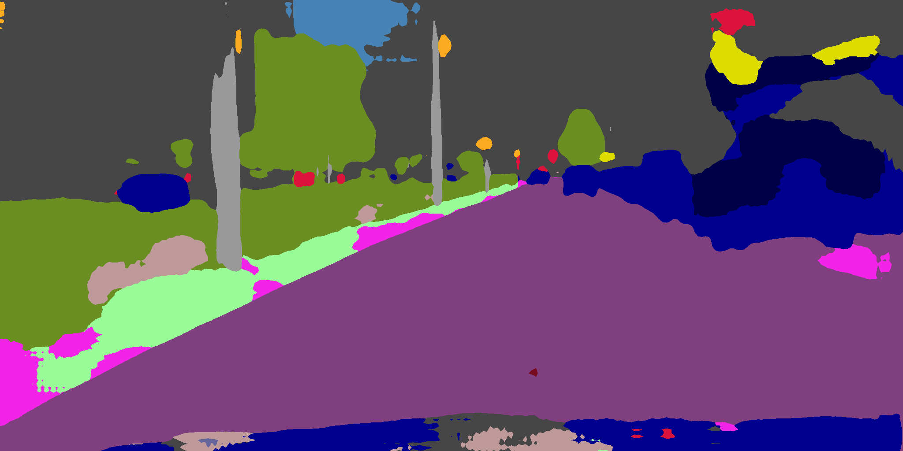
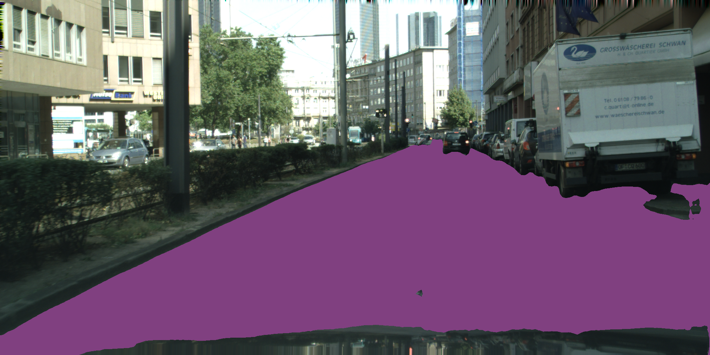

# DASNet - Drivable Area Segmentation Networks

Pytorch implementation of drivable area segmentation detection networks. 

# TODO
- [x] Getting started from this [OCNet project](https://github.com/PkuRainBow/OCNet) (they reported latest SoA results, Pytorch implementation, and can be combined with other networks like PSPNet and Deeplab)
  - [x] Train and test on CityScapes dataset (Their results on the val set of Cityscapes is ~79.5 mIoU, ours is ~78.7 mIoU)
  - [x] Test on our dataset
  - [x] Train and test on another datasat like ~~ADE20K or~~ BDD dataset
  - [x] Implement popular segmentation networks like PSPNet, Deeplab variants. 
- [ ] Redesign to support multiple datasets and multiple segmentation networks --> It is probably better to base on another project such as (DANet)[https://github.com/junfu1115/DANet] or (Context Encoding)[https://github.com/zhanghang1989/PyTorch-Encoding] since their implemenetations are way better. 

## Installation
- Docker image: `ascent-docker.zapto.org:443/ocnet` --> `docker.ascentrobotics.jp:443/ocnet` 

## Dataset
- Cityscapes: `/datashare/datasets/cityscapes`
- Ascent images: `/users/yizhou/rosbags`

## Example of training pairs
There are 30 different labels in Cityscapes dataset. Class ID and Train ID is assigned to each pixel. Since not all classes are used for evaluation, only 19 train IDs are used starting from 0 to 18. The ignoring labels that are not evaluated during the testing phase can be masked out using a predefined value such as 255 or -1. 

<table style="width:100%">
  <tr>
    <th>
      <p align="center">
 <a href="https://youtu.be/WBNw1tKe4xE"></a>
 <br>Original image
</p>
    </th>
    <th>
      <p align="center">
 <a href="https://youtu.be/2TiQuKux3JU"></a>
 <br>Ground truth annotation
</p>
    </th>
    <th>
      <p align="center">
 <a href="https://youtu.be/enVAMUN2qmE"></a>
 <br>Predicted output
</p>
    </th>
<th>
      <p align="center">
 <a href="https://youtu.be/enVAMUN2qmE"></a>
 <br>Drivable Area (i.e., Road)
</p>
    </th>
    
  </tr>
</table>


## Train model
- Run `make train`
- Train on `dgx01`: `kubectl create -f config/dasnet.yml`

```
usage: train.py [-h] [--data_dir DATA_DIR] [--train_data_list TRAIN_DATA_LIST]
                [--val_data_list VAL_DATA_LIST] [--output_file OUTPUT_FILE]
                [--dataset {cityscapes}] [--model_type {asp_oc_dsn}]
                [--cnn_type {resnet101}] [--start_from START_FROM]
                [--batch_size BATCH_SIZE] [--num_classes NUM_CLASSES]
                [--crop_size_h CROP_SIZE_H] [--crop_size_w CROP_SIZE_W]
                [--random_scale] [--random_mirror]
                [--ignore_label IGNORE_LABEL] [--learning_rate LEARNING_RATE]
                [--num_epochs NUM_EPOCHS] [--lr_update LR_UPDATE]
                [--max_patience MAX_PATIENCE] [--val_step VAL_STEP]
                [--num_workers NUM_WORKERS] [--dsn_weight DSN_WEIGHT]
                [--log_step LOG_STEP] [--seed SEED]
```

## Test model
- Run `make test`
- Test on `dgx01`: `kubectl create -f config/dasnet_test.yml`

```
usage: test.py [-h] [--test_data_list TEST_DATA_LIST]
               [--output_file OUTPUT_FILE] [--image_ext IMAGE_EXT]
               [--batch_size BATCH_SIZE] [--crop_size_h CROP_SIZE_H]
               [--crop_size_w CROP_SIZE_W] [--random_scale] [--random_mirror]
               [--store_output] [--output_dir OUTPUT_DIR]
               [--num_workers NUM_WORKERS]
               model_file

```

## Experimental Results

### Results on CityScapes (val set). All models were ran for 100 epochs, except for the last one.
The results are not as impressive as they reported. 

| Method                                                                 | mIoU  |
|------------------------------------------------------------------------|-------|
| Baseline                                                               | 71.98 |
| Baseline + Object Context (OC)                                         | 75.66 |
| Baseline + Pyramid Pooling Module (PPM) + Object Context (OC)          | 75.67 |
| Baseline + Atrous Spatial Pyramid Pooling (ASPP) + Object Context (OC) | 75.60 |
| Baseline + Atrous Spatial Pyramid Pooling (ASPP) + Object Context (OC) (200 epochs) | 78.70 |

## Acknowledgements
- [OCNet: Object Context Network for Scene Parsing](https://github.com/PkuRainBow/OCNet)
- [Dual Attention Network for Scene Segmentation](https://github.com/junfu1115/DANet)
- [Context Encoding for Semantic Segmentation](https://github.com/zhanghang1989/PyTorch-Encoding)
